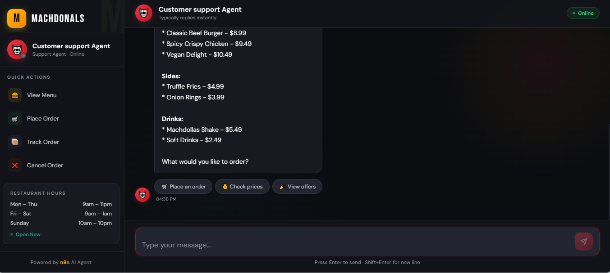
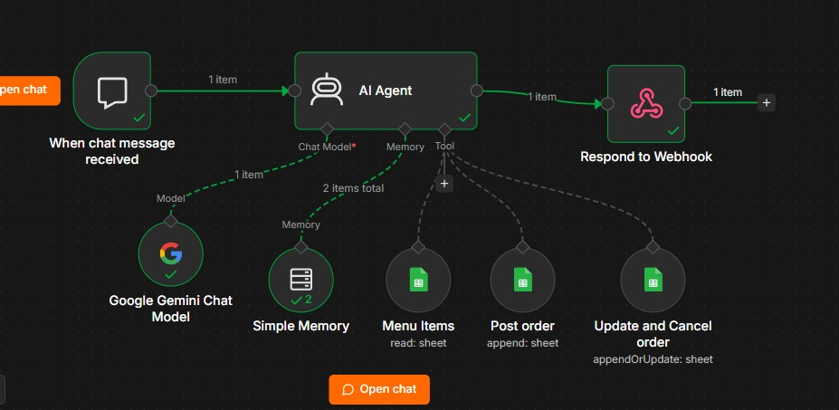

# 🍔 Machdollas AI Customer Support Agent

A production-ready AI customer support chatbot designed for Machdollas (a McDonald's-style restaurant). This project provides an interactive, modern web interface that communicates seamlessly with a robust **n8n** automation backend to handle customer queries, track orders, and display menu options.


## ✨ Features

- **Real-Time Chat Interface**: A beautiful, dark-themed UI with glassmorphism elements, micro-animations, and smooth transitions.
- **Smart AI Routing**: Powered by an n8n webhook, the agent intelligently handles natural language queries.
- **Quick Actions**: One-click quick reply buttons for common tasks like "View Menu", "Place Order", "Track Order", and "Cancel Order".
- **Dynamic Typing Indicators**: Simulates human-like response times with animated typing dots.
- **Responsive Design**: Fully optimized for both desktop and mobile devices.

## 🖼️ User Interface


## 🤖 n8n Workflow Architecture


### Workflow Nodes Explained:
1. **When chat message received (Webhook Trigger)**: Listens for incoming chat messages (POST requests) sent from the frontend.
2. **AI Agent (LangChain Agent)**: The core brain of the chatbot. It processes natural language queries using a strict set of rules to handle menu requests and strict flows for creating, updating, and canceling orders.
3. **Google Gemini Chat Model**: The underlying Large Language Model (Gemini-2.5-flash-lite) that powers the AI Agent's conversational abilities.
4. **Simple Memory (Window Buffer)**: Maintains the conversation context and history so the chatbot remembers what was said earlier in the chat.
5. **Menu Items (Google Sheets Tool)**: Connects to the Machdollas Google Sheet to read available menu items, prices, and preparation times.
6. **Post order (Google Sheets Tool)**: Automatically appends a new row to the Google Sheet when a customer places a brand new order.
7. **Update and Cancel order (Google Sheets Tool)**: Searches the Google Sheet by `Order ID` to check an order's status, update its items, or cancel it entirely.
8. **Respond to Webhook**: Takes the final response generated by the AI Agent and sends it back to the frontend to be displayed to the user.
## 🛠️ Technology Stack

- **Frontend**: Next.js, React, JavaScript, CSS3
- **Backend / Automation Flow**: [n8n](https://n8n.io/)

## 🚀 Architecture & Deployment

This project uses a decoupled architecture for maximum scalability:

1. **Frontend (Next.js)**: Handles the UI logic and API routes to communicate with the backend.
2. **Backend (n8n)**: Processes incoming webhooks, executes the AI/logic workflow, and returns JSON responses.

### Deployment Guide

#### 1. Backend (n8n)
- Deploy n8n to your preferred hosting provider.
- Expose the following environment variables:
  - `N8N_PORT=5678`
  - `WEBHOOK_URL=https://<your-n8n-url>`
  - `N8N_CORS_ORIGIN=*` *(Required to accept requests from the frontend)*
- Import the provided `McDonald's chatbot assistant copy (1).json` workflow into n8n.
- **Crucial**: Ensure the workflow is toggled to **Active** so the production webhook is registered.

#### 2. Frontend (Next.js)
- Configure the environment variables by creating a `.env.local` file with the n8n webhook URL.
- Build and start the Next.js application using `npm run build` and `npm run start`.

## ⚙️ Configuration

Set up the required environment variable for the frontend to connect to the n8n backend:

```env
N8N_WEBHOOK_URL=http://localhost:5678/webhook/9c586978-d61f-45ce-ae00-9c274f07ee26/chat
```

## 📝 License
This project is for educational/portfolio purposes.
